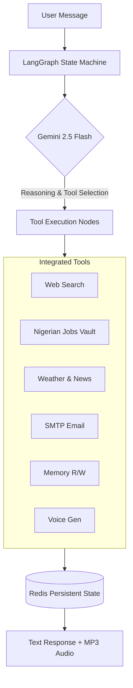

#  Ultimate AI Agent

> A production-grade AI agent featuring persistent cross-session memory, web search, email automation, and integrated Nigerian job intelligence. Built on LangGraph to deliver deterministic, stateful execution.

---

##  What Makes This Different?

Most AI chatbots suffer from amnesia—they forget who you are the moment you close the tab. **This agent remembers.** By utilizing Redis as a memory backend, the agent persists user preferences, job profiles, and facts across sessions. Tell it your name and career goals once, and it will recall them in every future conversation. A built-in memory sidebar provides full transparency into exactly what the agent knows about you.

##  Architecture

The system relies on explicit state management rather than abstracted chains, ensuring reliable tool execution and memory retrieval.



##  Tool Ecosystem

The agent dynamically selects from the following capabilities based on the conversation context:

| Tool | Capability |
| :--- | :--- |
| `search_web` | Executes live Google searches via Serper API. |
| `search_jobs` | Queries a live PostgreSQL vault of Nigerian job listings. |
| `get_weather` | Retrieves real-time meteorological conditions for any city. |
| `get_news` | Pulls the latest news headlines on requested topics. |
| `send_email` | Automates outbound email delivery via Gmail SMTP. |
| `remember_fact` | Extracts and writes core user preferences to Redis. |
| `recall_fact` | Injects stored user preferences back into the active context. |
| `text_to_speech` | Synthesizes the final text response into downloadable MP3 audio. |

##  Why LangGraph Over LangChain?

LangChain abstracts too much, burying the underlying logic in layers that frequently break in production. **LangGraph** hands back control. It allows you to define the agent as an explicit state machine, dictating exactly what happens at each node and edge. It prioritizes practical execution, clean structure, and reliable engineering over "black box" magic.

##  Tech Stack

* **Orchestration:** LangGraph (State machine architecture)
* **Intelligence:** Gemini 2.5 Flash (Reasoning & tool selection)
* **State & Memory:** Redis (Cross-session persistence)
* **Backend:** FastAPI (RESTful API & Web Interface)
* **Audio:** gTTS (Text-to-speech generation)
* **External APIs:** Serper API (Search integration)

---

##  Setup & Installation

### Prerequisites
* Python 3.10+
* Redis Server installed and running

### 1. Clone & Environment (Windows PowerShell)

```powershell
git clone https://github.com/exceliyoha53/ultimate-ai-agent
cd ultimate-ai-agent

# Create and activate virtual environment
python -m venv venv
.\venv\Scripts\Activate.ps1

# Install dependencies
pip install -r requirements.txt
```

### 2. Start Redis Server

```powershell
# If using winget
winget install Redis.Redis
redis-server
```

### 3. Environment Variables
Copy the template and fill in your API keys (Gemini, Serper, SMTP credentials, etc.).

```powershell
cp .env.example .env
```

### 4. Run the Application

```powershell
uvicorn main:app --reload
```
Navigate to `http://localhost:8000` to access the chat interface and memory dashboard.

---

##  Engineering Notes & Post-Mortem

### Blocking the Event Loop (The `psycopg2` Trap)
**The Problem:** `psycopg2` is a synchronous library. When integrated into an asynchronous FastAPI endpoint to query the job vault, database calls block the entire async event loop, causing severe performance bottlenecks.

**The Solution:** All synchronous database operations were offloaded to a thread pool to preserve async performance. 

```python
# Instead of running the sync query directly:
# result = db_query()

# Offload to a thread:
import asyncio
result = await asyncio.to_thread(db_query)
```
*Note: This pattern should be strictly applied to any synchronous I/O-bound library used within an async context.*